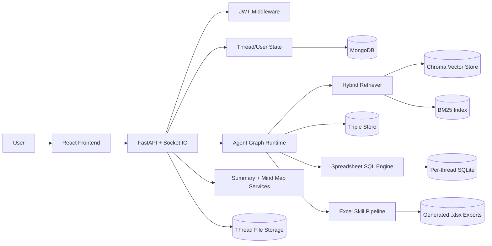

<div align="center">


<br/>

[](https://github.com)
[](https://python.org)
[](https://fastapi.tiangolo.com)
[](https://react.dev)
[](https://typescriptlang.org)
[](https://mongodb.com)
[](https://sqlite.org)


> **Natural language in. Decision-ready Excel out.**

</div>


<br/>


## What is AnalytiQ?
AnalytiQ is an AI-powered data assistant that lets you interact with your data using simple language.

You upload files, ask questions, and get:
- Clear answers
- Insights you can trust
- Downloadable Excel reports

No SQL. No formulas. No dashboards.

```
Upload → Ask → Understand → Act
```
<br/>

---

## The Problem We Solve
<div align="center">
    
| Pain Point | What Users Face |
|---|---|
| Complex Excel files | Hard to analyze without technical skills |
| Slow insights | Manually querying data takes hours |
| Tool overload | Most BI tools require training |
| Decision paralysis | Too much data, too little clarity |

</div>

#### Most users just want answers - not complex tools.
<br/>

---

## The Solution

AnalytiQ simplifies the entire process:

<div align="center">

| | Step | Description |
|:---:|:---|:---|
| 1st | **Upload** | Add your Excel, CSV, or image files |
| 2nd | **Ask** | Type your question in plain English |
| 3rd | **AI processes** | Understands intent, runs SQL queries |
| 4th | **Get results** | Answers, insights, or a full Excel report |

</div>
<br/>


---


## Core Capabilities


### 1. Natural Language Queries

Ask your data anything - no query language required:
```
"Which region is underperforming?"
"Compare this month with last month"
"What are the top 5 products by revenue?"
"Why are sales declining in Q3?"
```
The system understands your intent and finds the answer.

---

### 2. Data Processing Engine

The system:
- Converts questions into SQL queries  
- Runs them on your data  
- Handles large datasets  
- Combines multiple results when needed  

The output is explained in simple language.

---

### 3. Excel Report Generation

You can generate full Excel reports by describing what you need.

Example:
> “Create a report with summary, grouped data, and charts”

The system creates:
- Multi-sheet workbooks  
- Calculations and aggregations  
- Charts (bar, line, pie)  
- Proper formatting  

The result is a ready-to-use `.xlsx` file.

---

### 4. Background Processing

Excel generation runs in the background:
- No waiting screen  
- Progress can be tracked  
- File is available when ready  

---

### 5. Data Handling

Supported inputs:
- Excel (`.xls`, `.xlsx`)
- CSV (`.csv`)
- Images (`.jpg`, `.png`, etc.)

Uploaded data is:
- Structured automatically  
- Stored for fast querying  
- Ready for analysis  

---

### 6. Spreadsheet Intelligence

- Each sheet becomes a queryable table  
- Multiple sheets are handled automatically  
- Columns are cleaned and understood  
- Works with real-world messy data  

---

### 7. Trust and Transparency

Every answer clearly shows:
- **Data source**  - which file was used
- **Tables used** - which sheets contributed
- **Columns involved** - what data was analyzed

This helps users verify results.

---

### 8. Flexible Query Modes & Smart Context

Choose how AnalytiQ should answer:
<div align="center">
    
| Mode | Behavior |
|---|---|
| **Internal** | Uses only your uploaded data |
| **External** | Enriches answers with web knowledge |
| **Context** | Maintains chat history for follow-ups |
| **Self-Knowledge** | Falls back to general AI knowledge | 

</div>

---

### 9. Advanced Query Intelligence

The system can:
- Break complex questions into smaller parts  
- Run queries in parallel  
- Combine results into one answer  

If direct answers are not possible, it adapts and still provides useful output.

---

### 10. Image Understanding (OCR)

- Extracts text from images  
- Works with scanned documents  
- Converts visual data into usable information  

---

### 11. Smart Hybrid Retrieval

- Combines **keyword search** (BM25) + **semantic search** (vector embeddings)
- Finds the most relevant data across all your uploads
- Dramatically improves answer accuracy on large datasets
  
---

### 12. Workspace Management

- Work is organized into threads  
- Each thread has its own data and chat  
- Multiple datasets can be managed easily  

---

### 13. Insights Tools

- **Document Summaries** - instant overview of any uploaded file
- **Global Summaries** - cross-file insights across your workspace
- **Mind Map Generation** - visual knowledge mapping from your data

---

### 14. Export Options
<div align="center">
    
| Format | Use Case |
|---|---|
| Markdown | Clean, shareable chat exports |
| HTML | Web-ready formatted exports |
| Excel `.xlsx` | Structured, chart-rich reports |

</div>

---

### 15. Security

- JWT-based user authentication
- Controlled, isolated data access per user
- Safe, sandboxed file handling

---

### 16. Real-Time Experience

- Live WebSocket updates via Socket.IO  
- Fast responses  
- Smooth interaction  

<br/>

---

## How It Works

  
```
Upload file
    ↓
Choose mode 
    ↓
Ask question
    ↓
System processes data 
    ↓
Get answer or Excel report 
```
<div align="center">

<table>
  <tr>
    <td align="center">
      
      <br/><sub><b>Clean, minimal dashboard</b></sub>
    </td>
    <td align="center">
      
      <br/><sub><b>Name thread & upload files</b></sub>
    </td>
  </tr>
  <tr><td colspan="2"><br/></td></tr>
  <tr>
    <td align="center">
      
      <br/><sub><b>View all thread documents</b></sub>
    </td>
    <td align="center">
      
      <br/><sub><b>Create thread in seconds</b></sub>
    </td>
  </tr>
    <tr><td colspan="2"><br/></td></tr>
  <tr>
    <td align="center">
      
      <br/><sub><b>Select docs to summarize</b></sub>
    </td>
    <td align="center">
      
      <br/><sub><b>Auto-generated document summary</b></sub>
    </td>
      <tr><td colspan="2"><br/></td></tr>
    <tr>
    <td align="center">
      
      <br/><sub><b>Mind map generating in real-time</b></sub>
    </td>
    <td align="center">
      
      <br/><sub><b>Interactive, expandable mind map</b></sub>
    </td>
      <tr><td colspan="2"><br/></td></tr>
    <tr>
    <td align="center">
      
      <br/><sub><b>Export filtered data as Excel</b></sub>
    </td>
    <td align="center">
      
      <br/><sub><b>Studio panel with advanced settings</b></sub>
    </td>
      <tr><td colspan="2"><br/></td></tr>
  </tr>
</table>

</div>

---

## System Architecture



---

## Example Queries

- “Show revenue breakdown by region”  
- “Why are sales decreasing?”  
- “Compare performance across months”  
- “Create an Excel report with summary and charts”  

---

## Example Output
<div align="center">

<table>
  <tr>
    <td align="center">
      
      <br/><sub><b>Ask questions, get structured answers</b></sub>
    </td>
    <td align="center">
      
      <br/><sub><b>Branch-wise rankings in clean tables</b></sub>
    </td>
  </tr>
  <tr><td colspan="2"><br/></td></tr>
  <tr>
    <td align="center">
      
      <br/><sub><b>Flags data inconsistencies transparently</b></sub>
    </td>
    <td align="center">
      
      <br/><sub><b>Correlations broken into clear insights</b></sub>
    </td>
  </tr>
    <tr><td colspan="2"><br/></td></tr>
  <tr>
    <td align="center">
      
      <br/><sub><b>Patterns across multiple metrics</b></sub>
    </td>
    <td align="center">
      
      <br/><sub><b>Uncovers hidden trends automatically</b></sub>
    </td>
  </tr>
</table>

</div>


---

## Tech Stack
<div align="center">
    
| Layer | Technology |
|---|---|
| **Frontend** | React + TypeScript |
| **Backend** | Python 3.10+ · FastAPI · Socket.IO |
| **AI / LLM** | LangChain · LangGraph (Agent Graph Runtime) |
| **Data Processing** | Pandas · NLTK |
| **Query Engine** | SQLite (per-thread) |
| **Vector Search** | ChromaDB |
| **Keyword Search** | BM25 Index |
| **Database** | MongoDB |
| **Excel Output** | openpyxl / xlsxwriter |
| **Auth** | JWT Middleware |

</div>

<br/>

## Setup & Installation

> Tested on **Python 3.11** · **CUDA 12.4** · **Windows / Linux**


### 1. Clone the Repository

```bash
git clone https://github.com/Fyxod/NatWest-Code-for-Purpose.git
cd analytiq
```

---

### 2. Create a Virtual Environment

```bash
# Recommended: Python 3.11
py -3.11 -m venv venv

# Or if Python 3.11 is your default:
python -m venv venv
```

Activate it:

```bash
# Windows
venv\Scripts\activate

# macOS / Linux
source venv/bin/activate
```

---

### 3. Install Dependencies

```bash
pip install -r requirements.txt
```

> ⚠️ First-time install may take a while — includes heavy packages like `torch`, `sentence-transformers`, and `easyocr`.

---

### 4. Configure Environment Variables

```bash
cp .env.example .env
```

Then edit `.env` and fill in your values:

| Variable | Description |
|---|---|
| `SECRET_KEY` | Any long random string |
| `GEMINI_API_KEYS` | JSON array of keys — more keys = higher rate limits |
| `TAVILY_API_KEY` | Your Tavily search API key |
| `OPENAI_API_KEY` | Only needed if OpenAI is enabled in `core/constants.py` |
| `USE_VISION_MODEL` | `True` to enable vision/OCR features, `False` to skip |

> 💡 **LLM Priority Order:** `Local LLM → Gemini → OpenAI`
> Default config uses **Gemini only**. To switch providers, edit `core/constants.py`.
> Hit rate limits? Add more keys to `GEMINI_API_KEYS` — they rotate automatically.

---

### 5. Run the Application

Start the **backend** (first run downloads models — may take a few minutes):

```bash
py backend.py
```

In a **separate terminal** (venv activated), start the **frontend**:

```bash
py frontend.py
```

> Frontend runs at **`http://localhost:5173`** · Backend API at **`http://localhost:8000`**

</details>

---
## Why AnalytiQ?

> Most data tools are built for analysts. AnalytiQ is built for **everyone who needs answers.**
<div align="center">
    
| Traditional Tools | AnalytiQ |
|---|---|
| Requires SQL / coding | Plain English |
| Hours to build reports | Seconds |
| Static dashboards | Dynamic, queryable chat |
| Technical setup | Upload and go |
| Black-box results | Transparent sources |

</div>
<br/>


<div align="center">

**AnalytiQ turns questions into insights, insights into reports, and reports into decisions.**


</div>

